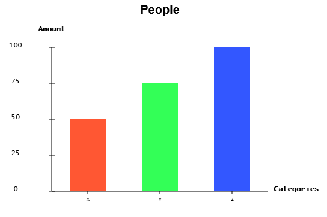
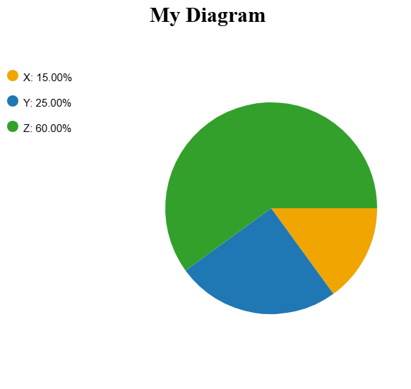
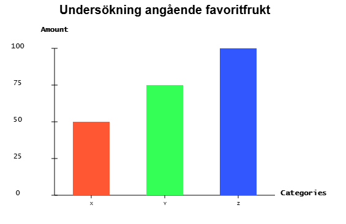
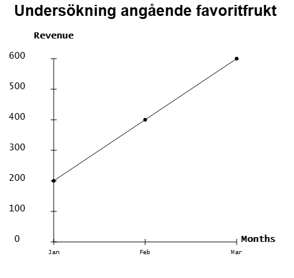

# DiagramModule

**DiagramModule** is a lightweight JavaScript library for creating customizable Pie, Bar, and Line charts on an HTML5 canvas. It is ideal for projects that require simple, flexible data visualization solutions.



## Version: 1.0.1
This version includes optimizations and refinements to the code for better performance and usability.

## Installation

You can easily install **DiagramModule** using npm:

```bash
npm install diagram-module
```

## Example Usage

### Importing and Initializing

After installation, you can import the **DiagramModule** into your project and initialize it with a canvas element.

- **Parameters:**
  - `canvasId` (string): The ID of your HTML canvas element.

```javascript
import { DiagramModule } from 'diagram-module';

const diagram = new DiagramModule('canvasId');
```

### `setSize(width, height)`

Sets the size of the diagram (not the canvas). The minimum size is 400x400px, and the maximum is 1200x1200px.

- **Parameters:**
  - `width` (number): The width of the diagram.
  - `height` (number): The height of the diagram.

```javascript
diagram.setSize(600, 600);
```

### `setTitle(title, font)`

Sets the title for the diagram with the specified font.

- **Parameters:**
  - `title` (string): The title of the chart (maximum 50 characters).
  - `font` (string): The font to use for the title (e.g., "Arial", "Helvetica").

```javascript
diagram.setTitle('Sales Data', 'Arial');
```

### `createPieChart(data, viewDataInPercent)`

Creates a pie chart based on the provided data. You can choose to display values as quantities or percentages.



- **Parameters:**
  - `data` (Array of Objects): An array of objects where each object has `label`, `value`, and `color` properties.
  - `viewDataInPercent` (boolean): Whether to display values as percentages (`true`) or actual values (`false`).

```javascript
const data = [
  { label: 'Product A', value: 30, color: '#FF0000' },
  { label: 'Product B', value: 50, color: '#00FF00' },
  { label: 'Product C', value: 20, color: '#0000FF' }
];
diagram.createPieChart(data, true);
```


### `createBarChart(data, labels)`

Creates a bar chart using the provided data and labels.



- **Parameters:**
  - `data` (Array of Objects): An array of objects where each object has `label`, `value`, and `color` properties.
  - `labels` (Object): Contains properties `yTitle`, `xTitle`, `maxValueForY`, and `numOfYLabels`.

```javascript
const barData = [
  { label: 'Q1', value: 150, color: '#FFA500' },
  { label: 'Q2', value: 200, color: '#FF4500' }
];
const barLabels = { yTitle: 'Revenue', xTitle: 'Quarters', maxValueForY: 250, numOfYLabels: 5 };
diagram.createBarChart(barData, barLabels);
```

### `createLineChart(data, labels)`

Creates a line chart using the provided data and labels.



- **Parameters:**
  - `data` (Array of Objects): An array of objects where each object has `label`, `value`, and `color` properties.
  - `labels` (Object): Contains properties `yTitle`, `xTitle`, `maxValueForY`, and `numOfYLabels`.

```javascript
const lineData = [
  { label: 'January', value: 120, color: '#32CD32' },
  { label: 'February', value: 140, color: '#32CD32' }
];
const lineLabels = { yTitle: 'Sales', xTitle: 'Months', maxValueForY: 200, numOfYLabels: 4 };
diagram.createLineChart(lineData, lineLabels);
```

### `clear()`

Clears the canvas. If the canvas is already cleared, a message is logged to the console.

```javascript
diagram.clear();
```

## Testing

The library includes a test app where the module has been manually tested for accuracy and functionality.

## Dependencies

- **Languages**: JavaScript (ES6+)
- **Library/Environment**: HTML5 Canvas API

## Bug Reports

If you encounter any bugs or issues, please open an issue on the [GitHub repository](https://github.com/yourusername/diagram-module).

## Contributing

Contributions are welcome! If you’d like to contribute, please open a pull request on the [GitHub repository](https://github.com/yourusername/diagram-module).

## License

This library is licensed under the [MIT license](https://opensource.org/licenses/MIT).

---

